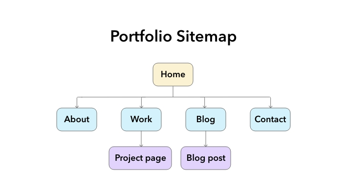

# Kobby Asomani | Coder Academy T1A2 | Portfolio Website

## **Links**
[Visit my portfolio site](https://kobbyasomani.github.io/)

[View my GitHub repository](https://github.com/kobbyasomani/kobbyasomani.github.io)

## **Purpose** 
This website is the first major project for the Coder Academy full-stack web development bootcamp.

The purpose of the site is to demonstrate the skills learned over the first five weeks of the course by building a live portfolio website.

The site provides a space to practice implementing the technologies learned so far; showcase work and professional background to prospective employers, and also to share a little bit about personal interests and hobbies.

*The site homepage on desktop*

| Intro  | About me |
| - | - |
|  |  |

*The introduction and about sections of the homepage on mobile.*

## **Functionality / Features**
Our brief was to design and build a site consisting of at least four pages, that incorporated at least four text and graphical 'components' built using a combination of HTML and CSS.

### **Responsive layout**
One of the key requirements was that the site be responsive, with a recommendation to follow a mobile-first approach.

- I designed each page with sections comprised of flexbox rows, so that the number and width of columns could be controlled at different viewport sizes.

- I made extensive use of nested CSS flexboxes to build rows and columns in various configurations for the navigation and page content.

I found that setting distinct background colours on elements while writing styles often helped to visualise and better understand how the flexboxes and child elements were behaving.

*Footer layout using nested flexboxes to control the number, size, and order of columns and nested elements.*

|     |     |
| --- | --- |
|  |  |
*Interest cards on the 'About' page, with an alternate layout for the final card that uses it as a background for text at wider sizes.*

### **Responsive Menu**
My site features a responsive navigation menu that is in a full-screen vertical layout (accessible by hamburger menu) on mobile and an inline list on wider displays.

*The hamburger menu before toggling.*

| *The open nav menu on mobile.* | *The open navigation menu on mobile with the current page highlighted.* |
| --- | --- |
|  |  |

*The inline nav menu for wide displays on desktop.*

### **Card Components**
My website is largely based on the concept of card components that contain micro-content which links to other parts of the site.

I started by creating an SCSS mixin which acted as a foundation, and then used it to create and extend the styling for all the various card components for images, blog posts, project summaries, and so on:

    @mixin card() {
        @include round-corners();
        width: 100%;
        flex: 1 1 auto;
        display: flex;
        flex-direction: column;
        margin-top: .5em;
        margin-bottom: .5em;
        background-color: $neutral-very-light;
        padding: $card-padding;
        transition: $transition-short;
        font-size: clamp(16px, .95em, 10vw);
        }
*The card mixin I used as a starting point for all card components.*

*Blog post and image cards featured on the home page.*
- Blog post cards combine a featured image, title, date, text snippet, and a link to the blog post page.
- Project cards have a similar format and also include links to live sites and GitHub repositories.
    - Users can click on the featured image, title, or link in the body of a blog or project card to take them to its dedicated page.
- Image cards use rounded corners (using the `border-radius` property) without the padding of informational cards.

### **Buttons & Social Icon Widgets**
**Resume Download**  
In the Experience section of the home page, viewers can see my most recent two roles in informational cards, download a PDF of my resume, and find links to my profiles on LinkedIn and Github.

**Social Links**
- I created social icon widgets for the footer, project cards, and places where I wanted to link to my professional accounts (LinkedIn and GitHub).
- I tried to include a button at the end of every major section or page to encourage visitors to continue looking at other content on the site.

| *Social icon widgets including links to GitHub, LinkedIn and Twitter.*  |   |
|---|---|
|  |  |

The icons used throughout the site are open source, and used under the [Font Awesome Free license](https://fontawesome.com/license/free) ([CC BY 4.0](https://creativecommons.org/licenses/by/4.0/)).

### **Contact Form**
A simple form built for the contact page. I styled the form fields, labels, and button using CSS to match the look and feel of the site.

|  Portfolio contact page with a contact form.   |  Mobile version   |
| --- | --- |
|  |  |

### **CSS Animations**
I used the CSS transition property to add simple animations for interactions such as mousing-over or focusing menu items, buttons, and cards. This helps to give some visual feedback to a user whenever an element is interactive.

*The card hover effect demonstrated on a blog card. When hovered over, the background colour changes, the card translates upwards slightly, and a drop shadow becomes visible.*

For a final touch and to add a bit of fun and colour to the site, I added commonly used symbols from HTML, CSS, and JavaScript (an opening and closing tag, a bracket, and a brace) as floating background graphic elements on some of the the transparent areas of the site. I also replaced all of the stock photography from earlier iterations of the site with my own photography.

I used absolute-positioning to set their positions, lowered their opacity, and added keyframe animation with the `animation-iteration-count` property to apply an infinitetly looping hover effect to the graphic elements.

*Colourful graphic elements created in Illustrator and exported in SVG format.*

*The 'About' section of the home page with graphic elements in the background.*

## **Sitemap**

[View all site wireframes](./docs/all-wireframes.pdf)

*My site has five pages accessible from the main navigation, and some sample blog posts and project pages linked from the 'Blog' and 'Work' pages respectively, some of which also feature as cards on the home page.*

## **Screenshots**
### **About page**

### **Work page**
Work cards featured on the home page. The first card in the row responsively switches to a horizontal format when space allows, with a more prominent button, as a way of showcasing the most recent project. 

Clicking on the project image, title, or link will take you to the individual project page, while clicking on the "View all projects" button takes you to the Work page.

The Work page with some placeholder text and original photos.

Initial wireframes of an individual project page at mobile, tablet, and desktop sizes.

| A sample project page with some placeholder content. | The project page includes a list of contributors and links to the live project and GitHub repository. |
| ---- | ---- |
|  |  |

### **Contact page**

### **Blog page**
Initial wireframes of the Blog at mobile, tablet, and desktop sizes.

The finished Blog page with some placeholder text and original photos.

|  A Blog page wireframe done in Adobe XD.  |   A sample individual blog post page.  |
|----|----|
|  |    |

## **Target Audience**
This website is aimed at prospective employers, and is designed to demonstrate my ability to utilise HTML and CSS to design and implement responsive layouts based on a deatiled brief; create reusable components with styling; and deploy a website to a live server. 

It's also for anyone who's interested in seeing the progress of my web development journey, and hopefully for me to look back on in a year's time to see how far I've come.

## **Teck Stack**
- **Visual Studio Code** - Source-code editor
- **HTML** — Markup
- **SCSS / CSS** — Preprocessing and organising CSS for layout and components
- **JavaScript** — Enabling functionality of the hamburger menu button and styling the menu items for mobile displays by adding and removing a class
- **Git / GitHub** — Version control and remote storage of all site files
- **GitHub Pages** — Deployment of the live site
- **Markdown** — Project documentation